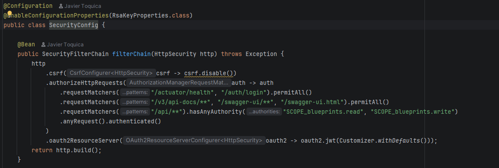

# Escuela Colombiana de Ingeniería Julio Garavito
## Arquitectura de Software – ARSW
### Laboratorio – Parte 2: BluePrints API con Seguridad JWT (OAuth 2.0)

Este laboratorio extiende la **Parte 1** ([Lab_P1_BluePrints_Java21_API](https://github.com/DECSIS-ECI/Lab_P1_BluePrints_Java21_API)) agregando **seguridad a la API** usando **Spring Boot 3, Java 21 y JWT (OAuth 2.0)**.  
El API se convierte en un **Resource Server** protegido por tokens Bearer firmados con **RS256**.  
Incluye un endpoint didáctico `/auth/login` que emite el token para facilitar las pruebas.

---

## Objetivos
- Implementar seguridad en servicios REST usando **OAuth2 Resource Server**.
- Configurar emisión y validación de **JWT**.
- Proteger endpoints con **roles y scopes** (`blueprints.read`, `blueprints.write`).
- Integrar la documentación de seguridad en **Swagger/OpenAPI**.

---

## Requisitos
- JDK 21
- Maven 3.9+
- Git

---

## Ejecución del proyecto
1. Clonar o descomprimir el proyecto:
   ```bash
   git clone https://github.com/DECSIS-ECI/Lab_P2_BluePrints_Java21_API_Security_JWT.git
   cd Lab_P2_BluePrints_Java21_API_Security_JWT
   ```
   ó si el profesor entrega el `.zip`, descomprimirlo y entrar en la carpeta.

2. Ejecutar con Maven:
   ```bash
   mvn -q -DskipTests spring-boot:run
   ```

3. Verificar que la aplicación levante en `http://localhost:8080`.

---

## Endpoints principales

### 1. Login (emite token)
```
POST http://localhost:8080/auth/login
Content-Type: application/json

{
  "username": "student",
  "password": "student123"
}
```
Respuesta:
```json
{
  "access_token": "eyJhbGciOiJSUzI1NiIsInR5cCI6IkpXVCJ9...",
  "token_type": "Bearer",
  "expires_in": 3600
}
```

### 2. Consultar blueprints (requiere scope `blueprints.read`)
```
GET http://localhost:8080/api/blueprints
Authorization: Bearer <ACCESS_TOKEN>
```

### 3. Crear blueprint (requiere scope `blueprints.write`)
```
POST http://localhost:8080/api/blueprints
Authorization: Bearer <ACCESS_TOKEN>
Content-Type: application/json

{
  "name": "Nuevo Plano"
}
```

---

## Swagger UI
- URL: [http://localhost:8080/swagger-ui/index.html](http://localhost:8080/swagger-ui/index.html)
- Pulsa **Authorize**, ingresa el token en el formato:
  ```
  Bearer eyJhbGciOi...
  ```

---

## Estructura del proyecto
```
src/main/java/co/edu/eci/blueprints/
  ├── api/BlueprintController.java       # Endpoints protegidos
  ├── auth/AuthController.java           # Login didáctico para emitir tokens
  ├── config/OpenApiConfig.java          # Configuración Swagger + JWT
  └── security/
       ├── SecurityConfig.java
       ├── MethodSecurityConfig.java
       ├── JwtKeyProvider.java
       ├── InMemoryUserService.java
       └── RsaKeyProperties.java
src/main/resources/
  └── application.yml
```

---

## Actividades propuestas

1. Revisar el código de configuración de seguridad (`SecurityConfig`) e identificar cómo se definen los endpoints públicos y protegidos.

   Mirando el `SecurityConfig` se nota fácilmente qué rutas necesitan token y cuáles no. En el código quedan marcadas como públicas `/actuator/health` y `/auth/login`, y esta última sí funciona así, tiene lógica porque justo ahí es donde uno pide el token para poder empezar a usar el resto de la API. Probando en la práctica, `/actuator/health` en realidad no queda abierta: sigue pidiendo autenticación (responde 401), porque el proyecto no tiene agregada la dependencia de Actuator en el `pom.xml`, entonces esa ruta no existe de verdad como endpoint y termina cayendo en la regla general de abajo. Las rutas de Swagger (`/v3/api-docs/**` y `/swagger-ui/**`) sí quedan libres de verdad, ahí cualquiera puede revisar la documentación sin loguearse primero. Ahora, todo lo que sea `/api/**` sí exige que el token traiga el scope `blueprints.read` o `blueprints.write`, según sea una consulta o una escritura. Y para cerrar, dejaron una regla general (`anyRequest().authenticated()`) que obliga a estar autenticado en cualquier otra ruta que no se haya mencionado antes o que no haya calzado con las reglas de arriba.

2. Explorar el flujo de login y analizar las claims del JWT emitido.

   Probando el login, al mandar usuario y contraseña a `/auth/login` el `AuthController` compara esos datos con lo que tiene guardado `InMemoryUserService`, que guarda las contraseñas ya encriptadas con bcrypt (no quedan en texto plano). Si las credenciales están bien, se arma un JWT firmado con RS256, y la llave con la que se firma se genera de nuevo cada vez que la aplicación arranca. Eso quiere decir que si se reinicia el servidor, los tokens que ya se habían entregado dejan de servir, porque la llave con la que se validaban ya no es la misma. Decodificando el token que devuelve el login (puntualmente la parte del medio, que viene en base64), se ve algo como esto:
   ```json
   {"iss":"https://decsis-eci/blueprints","sub":"student","exp":1789598288,"iat":1789598278,"scope":"blueprints.read blueprints.write"}
   ```
   Ahí se ve quién emitió el token, de qué usuario es, cuándo se creó, cuándo vence y qué permisos tiene. Algo que llama la atención es que en este login de práctica no importa si se entra como `student` o como `assistant`: a los dos les dan los mismos dos scopes completos, o sea que todavía no hay una diferencia real de roles entre ellos.

3. Extender los scopes (`blueprints.read`, `blueprints.write`) para controlar otros endpoints de la API, del laboratorio P1 trabajado.

   El proyecto original de la Parte 2 nada más traía dos endpoints de negocio, el `GET` y el `POST` de `/api/blueprints`. Para esta actividad se trajeron los endpoints reales de la Parte 1 (listar todos, buscar por autor, buscar por autor y nombre, crear un blueprint y agregar un punto), en un controlador nuevo (`BlueprintsAPIController`, bajo `/api/v1/blueprints`) para no tocar el controlador de ejemplo que ya existía. A cada endpoint se le puso `@PreAuthorize("hasAuthority('SCOPE_blueprints.read')")` en los que solo consultan, y el de `write` en los que crean o modifican algo (crear blueprint y agregar punto). Se probaron todos con un token real: sin token cualquiera de estas rutas responde 401, y con token responden bien (200 al consultar, 201 al crear, 202 al agregar un punto, 404 si el autor o el blueprint no existen). Quedó pendiente la parte de la persistencia en Postgres que traía el P1 original, se dejó solo la versión en memoria para no depender de una base de datos.

4. Modificar el tiempo de expiración del token y observar el efecto.

Configuración de la expiración:
   Se modificó el tiempo de vida del token JWT en el componente de seguridad de la aplicación (o en el archivo de propiedades), 
   configurándolo a un intervalo reducido (por ejemplo, 360 segundos o 6 minutos) con el fin de validar de forma ágil el comportamiento del sistema ante la 
   caducidad de credenciales.
Verificación de la generación exitosa:
   Al realizar una petición POST al endpoint de autenticación (/auth/login) con credenciales válidas, el sistema procesa la solicitud de manera correcta retornando un código de estado HTTP 200 OK. 
   En el cuerpo de la respuesta (Response Body), se observa la entrega del access_token junto con el parámetro expires_in: 360, el cual confirma que el tiempo de expiración configurado se está aplicando exitosamente


Observación del efecto (Token Expirado):

Comportamiento inicial: 
Al utilizar el token inmediatamente después de ser generado en cualquier recurso o endpoint protegido de la API, el servidor permite el acceso sin inconvenientes.
Comportamiento tras la expiración: Una vez transcurrido el tiempo establecido (360 segundos), al intentar consumir nuevamente un endpoint protegido utilizando el mismo token, el filtro de seguridad de la API 
rechaza la solicitud respondiendo con un código de error 401 Unauthorized, comprobando así que el mecanismo de validación por tiempo funciona de forma correcta y previene el uso de credenciales vencidas.

5. Documentar en Swagger los endpoints de autenticación y de negocio.

La documentación y exposición de los endpoints de autenticación y de negocio se implementó mediante la integración de Springdoc OpenAPI con Spring Security, 
configurando los permisos necesarios en el filtro de seguridad (SecurityFilterChain) para permitir el acceso público a la interfaz de Swagger UI y al recurso de login, 
manteniendo protegidas las rutas de la API bajo validación por tokens JWT firmados con criptografía RSA. Esto permite que, a través de la interfaz interactiva, 
se puedan probar de forma transparente tanto la autenticación de credenciales como el consumo autorizado de los recursos de negocio utilizando el esquema de seguridad Bearer.



---

## Lecturas recomendadas
- [Spring Security Reference – OAuth2 Resource Server](https://docs.spring.io/spring-security/reference/servlet/oauth2/resource-server/index.html)
- [Spring Boot – Securing Web Applications](https://spring.io/guides/gs/securing-web/)
- [JSON Web Tokens – jwt.io](https://jwt.io/introduction)

---

## Licencia
Proyecto educativo con fines académicos – Escuela Colombiana de Ingeniería Julio Garavito.
